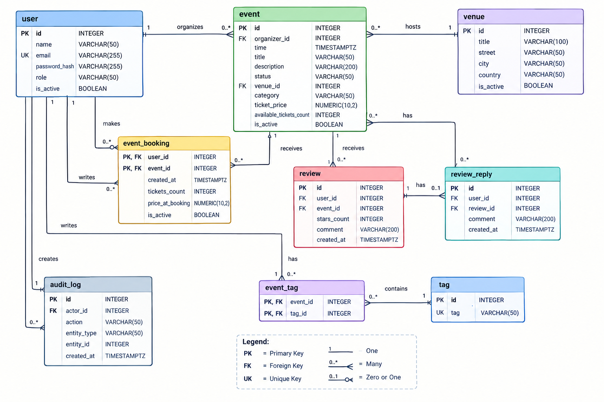

# Event Management API

A RESTful event management backend built with **FastAPI**, **SQLAlchemy**, **PostgreSQL**, and **Alembic**.

The API allows users to create and manage events, venues, bookings, reviews, replies, and tags. It also maintains audit logs for tracking user actions.

## Features

* User management
* Role-based user system
* Event creation and management
* One venue per event
* Event booking and ticket management
* Booking price history
* Event reviews and ratings
* Replies to reviews
* Event tagging system
* Audit logging
* PostgreSQL database
* SQLAlchemy ORM
* Alembic database migrations
* Automatic API documentation with Swagger UI and ReDoc

## Tech Stack

* **Python 3.11+**
* **FastAPI** — API framework
* **SQLAlchemy 2.0** — ORM
* **PostgreSQL** — Relational database
* **Alembic** — Database migrations
* **Pydantic** — Data validation and serialization
* **Uvicorn** — ASGI server

## Database Schema
